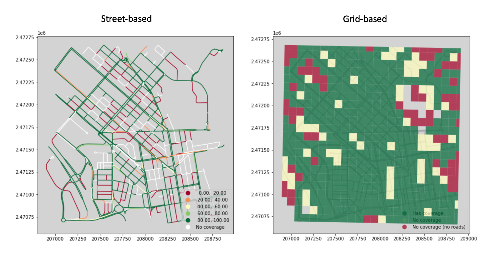

# Street View Imagery Quality Checker

## Introduction
It is crucial to understand the quality of a street view imagery (SVI) dataset to assess its ’fitness for purpose’. In this repository, we present: (1) a Jupyter notebook to quickly assess the quality of a SVI dataset by **9 quality elements**, each at its relevant **hierarchical levels** - image, street, or grid; (2) a sample dataset for running the notebook.

### Quality elements
A total of 9 quality elements are evaluated in the notebook with their spatial variations visualised:
* Spatial coverage
* Spatial continuity
* Count
* Age of the most recent coverage
* Age of the first available coverage
* Number of years covered
* Number of months covered
* Time elapsed between coverage
* Image blurriness

### Sample dataset
For demonstration, we provide a set of Mapillary SVI data from a 2 km x 2 km area in Kowloon, Hong Kong for running the notebook. This includes:
* A metadata file, obtained from the [Mapillary API](https://www.mapillary.com/developer/api-documentation)
* A folder of sample images, obtained from [Mapillary](https://www.mapillary.com/)

Apart from the SVI data, we also provide a raster file that enables the grid-based analysis, obtained from [WorldPop](https://www.worldpop.org/).

All data in the sample dataset was obtained under the [CC BY-NC-SA 4.0](https://creativecommons.org/licenses/by-nc-sa/4.0/) license.

## Expected outputs

The expected output for each quality element, if the sample dataset is used:

1. Spatial coverage

2. Spatial continuity

3. Count

4. Age of the most recent coverage

5. Age of the first available coverage

6. Number of years covered

7. Number of months covered

8. Time elapsed between coverage

9. Image blurriness

## Access
The sample dataset can be downloaded from [Google drive](https://drive.google.com/file/d/1UtAKOO5cgtqEQ7e4T4RiFkETmnLKO4El/view?usp=sharing).

## Reference, citation, and documentation
A paper is in progress, and the citation will be added here.

## License
This dataset is released under the [CC BY-NC-SA 4.0](https://creativecommons.org/licenses/by-nc-sa/4.0/) license.

## Contact
Feel free to contact [Yujun Hou](https://ual.sg/authors/yujun/) or [Filip Biljecki](https://ual.sg/authors/filip/) should you have any questions.
For more information, please visit [Urban Analytics Lab](https://ual.sg/), National University of Singapore.

## Acknowledgements
We appreciate the valuable contributions of the VGI community.

We thank our colleagues at the NUS Urban Analytics Lab for the discussions.

This research is part of the project Large-scale 3D Geospatial Data for Urban Analytics, which is supported by the National University of Singapore under the Start Up Grant R-295-000-171-133.
